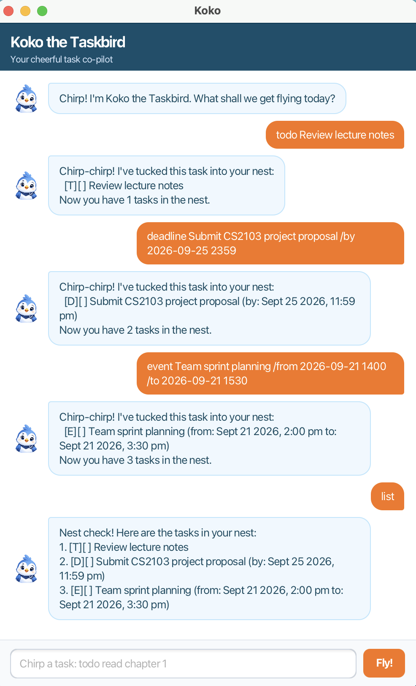

# Koko the Taskbird User Guide

Koko the Taskbird is a cheerful task manager that helps you organise to-dos, deadlines, and events.
Koko remembers your saved tasks when you open the app again.



## Quick start

1. Open Koko's GUI by running `koko.Launcher` or Gradle's `run` task.
2. Type a command in the box at the bottom of the window and press <kbd>Enter</kbd> or select **Fly!**.
3. Use `list` to see every task in your nest.

All commands are case-sensitive. Task numbers refer to the number shown by `list`.

## Features

### Add a to-do: `todo`

Adds a task that does not have a date or time.

```text
todo Review lecture notes for software architecture
```

### Add a deadline: `deadline`

Adds a task that must be completed by a particular date and time.

```text
deadline Submit project proposal /by 2026-09-25 2359
```

### Add an event: `event`

Adds an event with a start and end date and time.

```text
event Team sprint planning /from 2026-09-21 1400 /to 2026-09-21 1530
```

For deadlines and events, enter dates in the `yyyy-MM-dd HHmm` format. For example,
`2026-09-21 1400` means 21 September 2026 at 2:00 pm.

### List tasks: `list`

Shows every task in your nest. `[ ]` means the task is incomplete, while `[X]` means it is done.

```text
list
```

### Find tasks: `find`

Shows tasks whose descriptions contain the keyword.

```text
find project
```

### Mark or unmark a task: `mark`, `unmark`

Marks a task as complete or returns it to incomplete status.

```text
mark 2
unmark 2
```

### Update a task: `update`

Changes only the fields you provide. Use `/desc` for a description, `/by` for a deadline,
and `/from` and `/to` for an event. A to-do supports `/desc`; a deadline supports `/desc`
and `/by`; an event supports `/desc`, `/from`, and `/to`.

```text
update 1 /desc Review the architecture lecture
update 2 /by 2026-09-26 1800
update 3 /to 2026-09-21 1600
```

### Delete a task: `delete`

Removes a task from your nest.

```text
delete 3
```

### Say goodbye: `bye`

Ends the console session. In the GUI, Koko replies with a farewell message.

```text
bye
```
